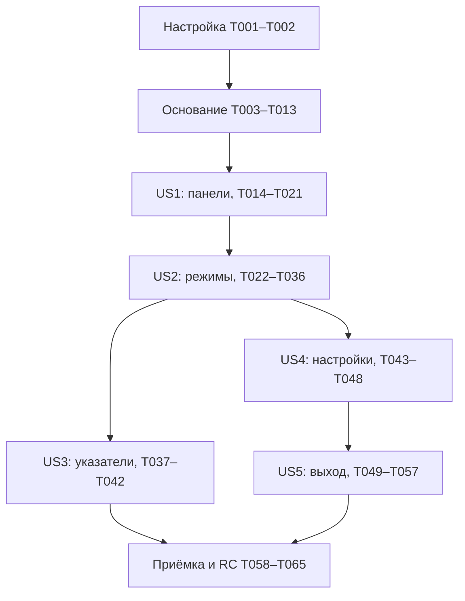

# Задачи: Второй релиз — внешний вид и режимы чтения

**Ввод**: Документы проектирования из `specs/002-reader-appearance/`.
**Дата**: 2026-10-02
**Ветка Git**: `release/v2.0.0`.
**Предварительные условия**: [plan.md](plan.md), [spec.md](spec.md), [research.md](research.md),
[data-model.md](data-model.md), [contracts/reader-ui.md](contracts/reader-ui.md), [quickstart.md](quickstart.md),
[performance-protocol.md](performance-protocol.md).

**Организация**: 65 задач, сгруппированных по 5 пользовательским историям. Общие задачи
подготавливают разделяемый слой чтения и раннее измерение основного риска.
**Проверки**: включены содержательные проверки жестов, пагинации, сохранения и восстановления,
заданные SC-001–008 и конституцией. Полные результаты устройства/производительности/участников
относятся к выполнению задач, а не к этой генерации. TDD пользователем отдельно не запрошен;
подразделы тестов идут перед реализацией и фиксируют нужное поведение. Ошибка компиляции новых
типов сама по себе не является доказательством обнаруженного дефекта поведения.
**Границы**: EPUB без DRM/FB2, офлайн, прежняя Room v1 и позиции; системный шрифт до 200%;
TalkBack, OPDS и новые форматы вне второго релиза.

## Формат: `[ID] [P?] [Story] Описание`

- Каждая задача имеет `- [ ] T###`, конкретные пути и зависимости с меньшими номерами.
- `[US1]`–`[US5]` соответствуют историям спецификации и используются только в их фазах.
- `[P]` означает самостоятельную работу над разными файлами после завершения указанных
  предварительных задач. Он не разрешает обходить зависимости.
- Новые файлы создаются в соответствующей задаче; все пути ниже относительно корня репозитория.
- Один commit реализует ровно одну задачу согласно конституции; несвязанные изменения не смешиваются.
- Отметка задачи означает выполненную работу и её условия. Отчёт измерения может быть создан
  с отрицательным результатом: это не означает прохождение критерия релиза.
- Reviewer-owned чеклисты не отмечаются и не пересматриваются этой командой.

## Соглашения о путях

Production: `app/src/main/java/com/hooreader/`; unit: `app/src/test/java/com/hooreader/`;
instrumentation: `app/src/androidTest/java/com/hooreader/`; debug probe:
`app/src/debug/java/com/hooreader/pagination/`; resources: `app/src/main/res/values/strings.xml`.
Доказательства: `specs/002-reader-appearance/evidence/`. Новые версии библиотек/модулей не нужны.

## Фаза 1: Настройка и воспроизводимый корпус

**Цель**: Зафиксировать исходное состояние и подготовить данные для точной пагинации без изменения зависимостей.

**Независимая проверка / завершение фазы**: Существующие unit/static/build проверки имеют зафиксированный результат; новые fixtures воспроизводимы и не попадают в пользовательскую библиотеку.

- [X] T001 Расширить генератор scripts/generate-import-corpus.py и описание app/src/androidTest/assets/books/README.md воспроизводимыми EPUB/FB2 с длинным абзацем, Unicode, списками, изображениями, пустыми/безымянными главами и нагрузочным набором 20 MB; большие fixtures генерировать при проверке, не хранить в Git.
- [ ] T002 Выполнить исходные ./gradlew :app:check :app:assembleDebug :app:assembleDebugAndroidTest и записать версии инструментария, доступные Android-стенды и результаты в specs/002-reader-appearance/implementation-baseline.md; отделить существующие ошибки от регрессий, закреплённые зависимости не обновлять. Зависит от T001.

## Фаза 2: Общий слой содержимого, позиции и ранний эксперимент

**Цель**: Подготовить потоковое чтение, единый layout и существующие координаты, необходимые обоим режимам; измерить основной риск до разработки постраничного UI.

**Независимая проверка / завершение фазы**: Spool сохраняет координаты/стили и пересоздаётся безопасно; чтение окна не сканирует FB2 повторно; прототип даёт непрерывные страницы и измеренные cold/warm результаты.

- [ ] T003 Добавить контрактные проверки последовательного потока и стабильности исходных координат EPUB/FB2 в app/src/test/java/com/hooreader/data/import/OrderedBookBlocksTest.kt: порядок глав/блоков, отмена коллектора, пустые главы, совпадение с текущим blocks(), отсутствие повторного прохода FB2 на каждую главу. Зависит от T002.
- [ ] T004 Добавить orderedBlocks() в app/src/main/java/com/hooreader/data/import/BookParser.kt и реализовать один последовательный обход в app/src/main/java/com/hooreader/data/import/Fb2BookParser.kt, app/src/main/java/com/hooreader/data/import/Fb2Scanner.kt и app/src/main/java/com/hooreader/data/import/EpubBookParser.kt; сохранять текущие chapterIndex/blockIndex, поддержать отмену и закрытие ресурсов на IO. Зависит от T003.
- [ ] T005 Описать BookContentIndex и codec в app/src/main/java/com/hooreader/data/local/BookContentIndex.kt и app/src/main/java/com/hooreader/data/local/ContentBlockCodec.kt: bookId/contentHash — «связь с исходной неизменной книгой», parserVersion/spoolVersion — «инвалидация после изменения нормализации», complete — «признак полностью записанного и проверенного spool»; сохранять text/styles/kind/mediaRef, chapterDirectory/checkpoints и «UTF-8 byte offsets spool не подменяют UTF-16 characterOffset». Зависит от T004.
- [ ] T006 Реализовать атомарный spool и random window reads в app/src/main/java/com/hooreader/data/local/BookContentIndexStore.kt и расширить app/src/main/java/com/hooreader/data/local/BookFileStorage.kt; размещать внутри filesDir/books/<bookId>/derived/content/, проверять принадлежность путей, игнорировать .part и пересоздавать повреждённое без потери книги/позиции; добавить app/src/test/java/com/hooreader/data/local/BookContentIndexStoreTest.kt для partial/corrupt/delete/cancellation. Зависит от T005.
- [ ] T007 Создать app/src/main/java/com/hooreader/data/repository/ReaderContentRepository.kt и подключить через app/src/main/java/com/hooreader/navigation/ReaderDependencies.kt: окна соседних глав со стабильными ключами, локальные image bounds/fallback, ленивое построение spool старых книг, «В RAM — окно до 128 блоков» без полной List книги и повторных FB2 scans. Зависит от T006.
- [ ] T008 Вынести AnnotatedString/styles, list indent, интервалы и типографику из app/src/main/java/com/hooreader/ui/reader/ContentBlockRenderer.kt в app/src/main/java/com/hooreader/ui/reader/BlockTextFactory.kt и app/src/main/java/com/hooreader/ui/reader/ReaderTypography.kt; TextMeasurer и renderer используют одну policy, sp/lineHeight, системную Density/font resolver и одинаковую ширину; image geometry определяется до публикации страниц. Зависит от T007.
- [ ] T009 Доработать app/src/main/java/com/hooreader/ui/reader/ReaderPositionResolver.kt и app/src/main/java/com/hooreader/ui/reader/ReaderScreen.kt для верхней видимой строки и LogicalAnchor; сохранить app/src/main/java/com/hooreader/domain/model/ReadingPosition.kt/Room v1 с ограничениями «UUID существующей READY книги», «≥0, индекс доступной главы», «≥0, исходный индекс внутри главы», «0..text.length, UTF-16 offset исходного Kotlin String», «конечный Double, 0..100», «≥0, монотонно увеличивается для новых сохранений»; покрыть offset и surrogate pair в app/src/test/java/com/hooreader/ui/reader/ReaderPositionResolverTest.kt. Зависит от T008.
- [ ] T010 Создать модели app/src/main/java/com/hooreader/ui/reader/pagination/LayoutKey.kt, app/src/main/java/com/hooreader/ui/reader/pagination/PageSlice.kt, минимальный app/src/main/java/com/hooreader/ui/reader/pagination/PageIndex.kt и app/src/main/java/com/hooreader/ui/reader/pagination/TextPaginator.kt с debug срезом app/src/debug/java/com/hooreader/pagination/PaginationProbe.kt: общие измеренные строки и draw/clipping, глава с новой страницы, bounded pages/layout и простой дисковый кэш точных counts/boundaries для cold/warm проверки; LayoutKey включает весь перечень из data-model.md, исключая цвета/controlsVisible при одинаковых метриках; PageSlice соблюдает «≥0; новая глава начинает страницу», «упорядоченный непересекающийся диапазон», «проверенные позиции внутри content viewport». Зависит от T009.
- [ ] T011 Добавить app/src/androidTest/java/com/hooreader/acceptance/PaginationProbeTest.kt и scripts/measure-reader-pagination.sh для прототипа T010 по specs/002-reader-appearance/performance-protocol.md: выбрать доступный физический стенд и до серии записать specs/002-reader-appearance/evidence/performance-profile.json с моделью/SoC/RAM/API/частотой/конфигурацией, hash корпуса и anchors; при недоступности стенда явно NOT_VERIFIED_DEVICE. Поддержать пять повторов каждого cold/warm сценария, сброс целевого индекса перед каждым cold, 20 MB обоих форматов, начало/позднюю главу, новый масштаб/ориентацию и реальный системный шрифт 200%; измерять первый читаемый кадр, точный номер, source passes, peak/resident memory и отмену старого LayoutKey отдельно. Зависит от T010.
- [ ] T012 Выполнить ранний срез T011 по performance-protocol.md и записать все пять исходных значений/минимум/медиану/максимум и profileId в specs/002-reader-appearance/evidence/pagination-probe.json, выводы в specs/002-reader-appearance/pagination-probe-results.md: для SC-004 каждый запуск требует готовую страницу с точным номером за ≤1 секунды; PreparingPages, warm-only, усреднение и эмулятор не подтверждают cold порог физического стенда. Зависит от T011.
- [ ] T013 По результатам T012 устранить выявленные проблемы измерителя, повторных scans, Unicode или крупнейшего блока в app/src/main/java/com/hooreader/ui/reader/pagination/TextPaginator.kt и app/src/main/java/com/hooreader/data/local/BookContentIndexStore.kt; при необходимости ввести bounded fragmentation с исходными offsets, повторить срез и обновить specs/002-reader-appearance/pagination-probe-results.md, явно сохранив невыполненный бюджет как риск, если дальнейшая оптимизация нужна в US2. Зависит от T012.

**Контрольная точка основания**: общий слой и прототип измерены, корректность координат/страниц
подтверждена. T012–T013 не требуют вымышленного прохождения ≤1 секунды: непройденный бюджет
переносится как явный риск в T035 и обязательную приёмку T061. Пока риск открыт, функциональные
истории можно реализовывать, а релизную готовность объявлять нельзя.

## Фаза 3: US1 — Чтение со скрытыми панелями (P1), первый MVP

**Цель**: В существующем вертикальном режиме панели скрыты; tap показывает/скрывает, drag скрывает и не превращается в tap, область книги стабильна.

**Независимая проверка / завершение фазы**: Самостоятельно в VERTICAL: 20 чистых касаний дают ровно 20 переключений; 100 scroll/cancel/boundary жестов не открывают панели, кнопки меню не меняют страницу, viewport и anchor неизменны.

### Проверки требований истории

- [ ] T014 [P] [US1] Добавить app/src/test/java/com/hooreader/ui/reader/ReaderChromeStateTest.kt по BookTap/NavigationDragStarted/OpenContents/OpenReaderSettings/DismissOverlay из contracts/reader-ui.md: исходное скрытие, однократный toggle, подавление tap до завершения/cancel жеста и взаимоисключение меню. Зависит от T013.
- [ ] T015 [P] [US1] Расширить app/src/androidTest/java/com/hooreader/reader/ReaderScreenTest.kt реальными касаниями/scroll/cancel/diagonal/boundary жестами и проверкой viewport/anchor по SC-001: jitter строго ниже touch slop даёт один toggle, достижение порога и возврат к down не дают toggle; cancel/второй палец/consumed событие не создают BookTap. Проверить единственный overlay при быстрых запросах содержания/настроек и Back; обновить ожидание доступа к кнопкам после первого tap, не заменять input прямым вызовом callbacks. Зависит от T013.

### Реализация и подтверждение истории

- [ ] T016 [US1] Реализовать app/src/main/java/com/hooreader/ui/reader/ReaderChromeState.kt и app/src/main/java/com/hooreader/ui/reader/ReaderChromeReducer.kt с «controlsVisible=false, overlay=NONE» и «NONE, CONTENTS, READER_SETTINGS, EXIT_CONFIRMATION; состояния взаимоисключающие»; состояние панели не меняет логическую позицию и layout, временный exit variant остаётся неактивным до US5. Зависит от T014, T015.
- [ ] T017 [P] [US1] Создать app/src/main/java/com/hooreader/ui/reader/BookGestureHandler.kt по contracts/reader-ui.md: системный ViewConfiguration.touchSlop, максимальное удаление от down за весь gesture, достижение порога фиксирует drag до up/cancel даже при возврате к down и на границе. Tap только при обычном отпускании одного пальца с движением строго ниже порога; cancel/long press/второй палец/consumed событие не дают toggle. Не потреблять scroll/pager события и не включать controlsVisible в pointerInput key. Зависит от T016.
- [ ] T018 [P] [US1] Создать app/src/main/java/com/hooreader/ui/reader/ReaderControls.kt с применимыми выходом/настройками/содержанием/переходами глав как отдельный overlay sibling; собственные touch targets и события кнопок, адаптивные подписи, отсутствие скрытых интерактивных панелей вне композиции. Зависит от T016.
- [ ] T019 [US1] Перестроить app/src/main/java/com/hooreader/ui/reader/ReaderScreen.kt на постоянный BookViewport/Box и подключить reducer/gestures к app/src/main/java/com/hooreader/ui/reader/ReaderViewModel.kt; панели накладываются и не меняют page constraints/anchor; открытая книга изначально скрывает управление, в VERTICAL остаются только глава и процент сверху, название книги/число глав и прочие значения скрыты; полная стилизация и fallback указателей относятся к US3. Зависит от T017, T018.
- [ ] T020 [US1] Подключить app/src/main/java/com/hooreader/navigation/HooReaderNavHost.kt и app/src/main/java/com/hooreader/ui/reader/TableOfContentsSheet.kt к единственному overlay в app/src/main/java/com/hooreader/ui/reader/ReaderViewModel.kt; удалить независимые mutable флаги reader menus из NavHost/sheets. Они отображают состояние и передают события: ровно один menu, dismiss/ChapterSelected скрывают панели, события menu не проходят к книге; сохранить доступ к работе меню/выходу в Opening/RecoverableError. Зависит от T019.
- [ ] T021 [US1] Выполнить проверки T014–T015 и минимальный путь US1 из quickstart.md, сохранить результаты viewport invariants, жестов и пяти измерений появления панелей по performance-protocol.md/profileId в specs/002-reader-appearance/quickstart-results.md; каждый запуск ≤0,3 секунды на физическом стенде, иначе FAIL/NOT_VERIFIED_DEVICE. Дефекты исправлять в компонентах US1, не объявлять всю функциональность релиза готовой. Зависит от T020.

## Фаза 4: US2 — Выбор вертикального или постраничного чтения (P1)

**Цель**: Два режима с точной постраничной разбивкой, переходами глав, сохранением логического места и долговечным выбором.

**Независимая проверка / завершение фазы**: На EPUB/FB2 переключить режим в середине длинного абзаца, пройти границы глав туда/обратно, изменить геометрию, перейти по содержанию и перезапустить; нет пропусков/дубликатов, открыта страница с anchor или вертикальная позиция в пределах одного абзаца.

### Проверки требований истории

- [ ] T022 [P] [US2] Добавить app/src/test/java/com/hooreader/ui/reader/pagination/TextPaginatorTest.kt и app/src/test/java/com/hooreader/ui/reader/pagination/PageIndexTest.kt по прототипу T010: непрерывные ranges/styles, surrogate pairs, длинный абзац, списки/images/fallback, новая страница главы, точный prefix/globalPageNumber, frontier≠EOF и invalidation по LayoutKey. Зависит от T021.
- [ ] T023 [P] [US2] Добавить app/src/androidTest/java/com/hooreader/reader/PagedReaderTest.kt: один swipe=одна страница, cancel/boundaries, двунаправленные главы, содержание, настоящие text layout и сохранение anchor при смене режима/масштаба/ориентации; временное PreparingPages не считать Reading. Зависит от T021.

### Реализация и подтверждение истории

- [ ] T024 [US2] Создать app/src/main/java/com/hooreader/domain/model/ReadingMode.kt и дополнить app/src/main/java/com/hooreader/domain/model/ReaderPreferences.kt значениями «ReadingMode VERTICAL/PAGINATED», default «VERTICAL»; сохранить theme «ReaderTheme LIGHT/DARK», default «LIGHT», fontScale «конечный Float, 0,75–2,0», default «1,0» из data-model.md, режим общий для всех книг. Зависит от T022, T023.
- [ ] T025 [US2] Добавить reading_mode в app/src/main/java/com/hooreader/data/local/ReaderPreferencesRepository.kt и setReadingMode в app/src/main/java/com/hooreader/ui/settings/ReaderSettingsViewModel.kt; «Отсутствующий или неизвестный reading_mode даёт VERTICAL», прежние theme/font_scale не теряются; расширить app/src/test/java/com/hooreader/data/local/ReaderPreferencesRepositoryTest.kt проверкой старого файла, enum fallback и restart. Зависит от T024.
- [ ] T026 [US2] Развить PageSlice/LayoutKey и app/src/main/java/com/hooreader/ui/reader/pagination/PageIndex.kt из прототипа: globalPageNumber — «1 + localPageIndex + сумма точных counts предыдущих глав», fragments — «текстовые строки, списки, media/fallback с исходными координатами»; startAnchor/endAnchorExclusive/geometry сохраняют ограничения T010, ключ использует resolved metrics/locale/insets/font versions и не меняется при toggle панелей. Зависит от T025.
- [ ] T027 [US2] Довести app/src/main/java/com/hooreader/ui/reader/pagination/TextPaginator.kt до всего поддерживаемого содержимого: page packing реальных строк, перенос длинного блока без независимого layout substring, цельные пропорциональные images с предопределёнными bounds/fallback, пустая глава=одна fallback страница, точные counts предыдущих глав, ограниченные batch measurements и layout cache. Зависит от T026.
- [ ] T028 [US2] Создать app/src/main/java/com/hooreader/data/local/PageIndexStore.kt: дисковые boundaries/checkpoints/completedPrefix/eofKnown в каталоге книги, атомарный валидируемый prefix и resume, reuse только актуального LayoutKey, «Количество сохранённых layouts ограничивается двумя последними ключами на книгу»; eviction/corruption/delete не меняют Room позицию; добавить app/src/test/java/com/hooreader/data/local/PageIndexStoreTest.kt. Зависит от T027.
- [ ] T029 [US2] Создать app/src/main/java/com/hooreader/ui/reader/pagination/PagedContentRenderer.kt для измеренных PageSlice: draw/clipping исходных TextLayoutResult, те же spans/list geometry и локальные images/fallback, координаты внутри content viewport; не удерживать все layouts книги и не менять boundaries после bitmap load. Зависит от T028.
- [ ] T030 [US2] Создать app/src/main/java/com/hooreader/ui/reader/PagedReaderContent.kt с foundation HorizontalPager, одной страницей на fling, сохранением по settledPage, стабильным absolute-index mapping при загрузке frontier и EOF только из источника; подключить BookGestureHandler, на Cancel и первой/последней странице управление не открывается. Зависит от T029.
- [ ] T031 [US2] Добавить Reading/PreparingPages pipeline и GeometryChangeOrigin USER_PREFERENCE/SYSTEM_CONFIGURATION в app/src/main/java/com/hooreader/ui/reader/ReaderViewModel.kt: effectiveMode/logicalPosition/layoutGeneration, отмена старых jobs, результаты только актуальных generation/LayoutKey; инвариант «показ страницы, содержащей anchor, не перезаписывает его первым символом этой страницы», явное перелистывание сохраняет начало settledPage. USER_PREFERENCE требует flush перед сменой режима/масштаба, при ошибке прежний effective выбор и retry. SYSTEM_CONFIGURATION сразу восстанавливает anchor из памяти в актуальных viewport/font metrics без ожидания IO; доработать app/src/main/java/com/hooreader/ui/reader/ReadingPositionSaver.kt для pending revision, видимой ошибки и retry последней позиции без отката геометрии/anchor при старом write completion. Зависит от T030.
- [ ] T032 [US2] Добавить выбор «Вертикальная прокрутка»/«Постранично» рядом с масштабом в app/src/main/java/com/hooreader/ui/settings/ReaderSettingsSheet.kt и строки app/src/main/res/values/strings.xml; обозначить текущий выбор, автоматически применить/сохранить режим, сохранённый выбор восстанавливать для всех книг. Зависит от T031.
- [ ] T033 [US2] Подключить content/page repositories и новый renderer в app/src/main/java/com/hooreader/navigation/ReaderDependencies.kt, app/src/main/java/com/hooreader/navigation/HooReaderNavHost.kt и app/src/main/java/com/hooreader/ui/reader/ReaderScreen.kt; вертикальный список использует окна соседних глав, содержание и кнопки перехода работают в effectiveMode, в PAGINATED базовые указатели уже показывают главу сверху и правильный номер снизу, без процента; VERTICAL сохраняет главу/процент, полная стилизация относится к US3. Зависит от T032.
- [ ] T034 [US2] Выполнить SC-003 и проверки T022–T023, расширить app/src/androidTest/java/com/hooreader/reader/ReadingPositionRestoreTest.kt, app/src/test/java/com/hooreader/ui/reader/ReaderViewModelTest.kt и app/src/test/java/com/hooreader/ui/reader/ReadingPositionSaverTest.kt сценарием restoreAnchor внутри длинного абзаца, быстрыми geometry changes/failed flush и reopen. Раздельно проверить USER_PREFERENCE с прежним выбором при сбое и SYSTEM_CONFIGURATION с новой геометрией/тем же anchor несмотря на IO failure, навигацией после ошибки, retry последней revision и поздним успехом старой записи; зафиксировать результаты US2 в specs/002-reader-appearance/quickstart-results.md. Зависит от T033.
- [ ] T035 [US2] Измерить и оптимизировать production cold/warm пагинацию по performance-protocol.md с пятью исходными значениями, profileId и оценкой по максимуму через app/src/androidTest/java/com/hooreader/acceptance/PaginationProbeTest.kt и scripts/measure-reader-pagination.sh, исправляя app/src/main/java/com/hooreader/ui/reader/pagination/TextPaginator.kt/app/src/main/java/com/hooreader/data/local/PageIndexStore.kt/app/src/main/java/com/hooreader/data/local/BookContentIndexStore.kt; добиться ≤1 секунды для страницы с точным номером или явно оставить непройденный release criterion в specs/002-reader-appearance/performance-results.md, не заменять номер оценкой. Зависит от T034.
- [ ] T036 [US2] Обновить specs/002-reader-appearance/quickstart-results.md проверкой обоих режимов на EPUB/FB2, границ главы/книги, отсутствия пропусков/дублирования и сохранения режима; checkpoint US2 допускает функциональную демонстрацию, но release SC-004 остаётся незавершённым при непройденном T035. Зависит от T035.

## Фаза 5: US3 — Ненавязчивые указатели положения (P1)

**Цель**: Глава/номер для страниц и глава/процент для вертикального режима, читаемые указатели без перекрытия книги.

**Независимая проверка / завершение фазы**: В обеих темах и режимах пройти границу глав, содержание и reopen; виден только предусмотренный показатель, он соответствует первому видимому фрагменту, доступен при системном шрифте 200%.

### Проверки требований истории

- [ ] T037 [P] [US3] Добавить app/src/test/java/com/hooreader/ui/reader/ReadingIndicatorResolverTest.kt: первая видимая глава, «Глава N»/нет разделов, точный globalPageNumber, whole-book progress, начало/конец/одноэлементная книга, целый процент и запрет номера/процента чужого режима. Зависит от T036.
- [ ] T038 [P] [US3] Добавить app/src/androidTest/java/com/hooreader/reader/ReadingIndicatorsTest.kt: EPUB/FB2 × modes/themes, переходы главы/содержания, маленький/длинный title, отсутствие перекрытия текста и unchanged viewport/page slices при toggle панелей; использовать tags UI-контракта. Зависит от T036.

### Реализация и подтверждение истории

- [ ] T039 [US3] Создать app/src/main/java/com/hooreader/ui/reader/ReadingIndicatorResolver.kt и подключить позицию в app/src/main/java/com/hooreader/ui/reader/ReaderViewModel.kt: название первого видимого фрагмента, fallback главы; progress — «Для конца доступного содержимого принудительно 100, для начала — 0, включая одноэлементную книгу», «в UI целый процент получается усечением к меньшему целому», глобальный номер только из точного PageIndex. Зависит от T037, T038.
- [ ] T040 [US3] Создать app/src/main/java/com/hooreader/ui/reader/ReadingIndicators.kt и строки app/src/main/res/values/strings.xml: сверху глава+процент VERTICAL, глава PAGINATED, снизу номер PAGINATED; базовые токены research R8, указатели меньше и менее контрастны основного текста, ellipsis только названия, процент/номер полностью различимы; sp и реальная Density до 200%. Зависит от T039.
- [ ] T041 [US3] Интегрировать измеренные постоянные полосы в app/src/main/java/com/hooreader/ui/reader/ReaderScreen.kt и app/src/main/java/com/hooreader/ui/reader/pagination/LayoutKey.kt: полосы не перекрывают text/images, LayoutKey пересчитывается при изменении их реальных размеров, но не при controlsVisible; название/показатель обновляются при restored anchor/scroll/swipe/TOC. Зависит от T040.
- [ ] T042 [US3] Выполнить T037–T038 и визуальную проверку указателей на обоих режимах/темах/ориентациях с реальным системным максимумом; сохранить screenshots и результаты в specs/002-reader-appearance/evidence/indicators/ и specs/002-reader-appearance/quickstart-results.md, отличать эту проверку от будущего SC-007 с участниками. Зависит от T041.

## Фаза 6: US4 — Настройки применяются без «Готово» (P2)

**Цель**: Автоприменение и последовательное сохранение темы, масштаба и режима; обычное закрытие меню с предсказуемым retry.

**Независимая проверка / завершение фазы**: Изменить каждый параметр, закрыть меню каждым способом, открыть снова/перезапустить; выбор сохраняется, «Готово» отсутствует; ошибка одного поля не теряется после успеха другого, быстрые scale increments используют последнее requested значение.

### Проверки требований истории

- [ ] T043 [P] [US4] Расширить app/src/test/java/com/hooreader/ui/settings/ReaderSettingsViewModelTest.kt для rapid intents, failed field + success другого + retry, замены старого pending того же поля, ошибок flush и восстановления persisted после процесса; ожидать все актуальные pending изменения, не единственную retry closure. Зависит от T036.
- [ ] T044 [P] [US4] Обновить app/src/androidTest/java/com/hooreader/settings/ReaderSettingsTest.kt по автоматическому применению и закрытию Back/outside/swipe, отсутствию «Готово», спуску меню к hidden chrome, ошибкам и шрифту 200%; не использовать удаляемую кнопку как способ завершения. Зависит от T036.

### Реализация и подтверждение истории

- [ ] T045 [US4] Создать app/src/main/java/com/hooreader/ui/settings/SettingsWriteState.kt и последовательную очередь intentions в app/src/main/java/com/hooreader/ui/settings/ReaderSettingsViewModel.kt с полями «persistedSnapshot, requestedSnapshot, pendingFields, error»; «Успех удаляет только подтверждённые pendingFields», «Ошибка другого поля не сбрасывается»; app/src/main/java/com/hooreader/data/local/ReaderPreferencesRepository.kt редактирует только изменённые keys атомарно, retry пишет актуальные pending значения. Зависит от T043, T044.
- [ ] T046 [US4] Удалить «Готово» из app/src/main/java/com/hooreader/ui/settings/ReaderSettingsSheet.kt и ненужную reader-only строку app/src/main/res/values/strings.xml; тему/режим применить при выборе, slider — при отпускании, increment/decrement считать от requested; scrollable/adaptive menu, ошибка и retry доступны, все dismiss возвращают hidden chrome. Зависит от T045.
- [ ] T047 [US4] Подключить requested/effective/persisted settings и pending ошибки в app/src/main/java/com/hooreader/navigation/HooReaderNavHost.kt и app/src/main/java/com/hooreader/ui/theme/HooReaderTheme.kt: выбор автоматически отражается на читалке, geom changes только после успешного flush, failed flush удерживает место/старую геометрию; root theme и reader не спорят между optimistic и persisted значениями. Зависит от T046.
- [ ] T048 [US4] Выполнить T043–T044, проверить совместимость старых theme/font_scale и сохранение текущего mode после закрытия/перезапуска; обновить specs/002-reader-appearance/quickstart-results.md по SC-004/SC-005 и старым app/src/test/java/com/hooreader/data/local/ReaderPreferencesRepositoryTest.kt регрессиям, без новых зеркальных тестов удаления кнопки. Зависит от T047.

## Фаза 7: US5 — Защита от случайного выхода из книги (P2)

**Цель**: Настройки приложения и сохранённая защита выхода; Back/menu/dialog имеют единый приоритет, навигация только после успешного flush.

**Независимая проверка / завершение фазы**: Из настоящего destination проверить default/оба значения переключателя, повторный запуск, экранный выход/Back, dismiss меню до запроса, подтверждение/отмену, failed save/retry и несколько быстрых запросов; ON_STOP не открывает dialog.

### Проверки требований истории

- [ ] T049 [P] [US5] Добавить app/src/test/java/com/hooreader/ui/reader/ReaderExitStateTest.kt по ExitRequested/Cancelled/Confirmed/FlushSucceeded/Failed: один dialog/effect, сохранение прежнего chrome/anchor после cancel, повторный запрос во время SAVING и failed flush без навигации. Зависит от T048.
- [ ] T050 [P] [US5] Расширить app/src/androidTest/java/com/hooreader/navigation/HooReaderNavHostTest.kt и добавить app/src/androidTest/java/com/hooreader/settings/AppSettingsTest.kt с настоящим ReaderDestination: default true, Back/menu priority, dialog Back/outside cancel, confirmed exit/position, false/restart; injected readerContent сам по себе не засчитывать как проверку защиты. Зависит от T048.

### Реализация и подтверждение истории

- [ ] T051 [US5] Создать app/src/main/java/com/hooreader/domain/model/AppPreferences.kt с «Boolean», default «true» для confirmReaderExit; добавить confirm_reader_exit и AppPreferences flow в app/src/main/java/com/hooreader/data/local/ReaderPreferencesRepository.kt, используя тот же singleton reader_preferences; расширить app/src/test/java/com/hooreader/data/local/ReaderPreferencesRepositoryTest.kt default/старый файл/сохранение/cross-field preservation и совместимую pending queue US4. Зависит от T049, T050.
- [ ] T052 [US5] Создать app/src/main/java/com/hooreader/ui/settings/AppSettingsScreen.kt и app/src/main/java/com/hooreader/ui/settings/AppSettingsViewModel.kt с «Подтверждать выход из книги»: автоприменение, сохранение через shared settings queue, pending error/retry, adaptive подпись при 200%; выключение/включение действует для всех книг без «Готово». Зависит от T051.
- [ ] T053 [US5] Добавить маршрут app settings в app/src/main/java/com/hooreader/navigation/HooReaderRoutes.kt и app/src/main/java/com/hooreader/navigation/HooReaderNavHost.kt, кнопку библиотеки в app/src/main/java/com/hooreader/ui/library/LibraryScreen.kt и передачу callback в app/src/main/java/com/hooreader/ui/library/ImportBookLauncher.kt; обычный Back settings возвращает в библиотеку, доступ не зависит от открытой книги. Зависит от T052.
- [ ] T054 [US5] Создать app/src/main/java/com/hooreader/ui/reader/ReaderExitDialog.kt и строки app/src/main/res/values/strings.xml: «Выйти из книги?», «Продолжить чтение», «Выйти»; Back/outside эквивалентны продолжению, adaptive/vertical actions при крупном шрифте, отсутствие второго запроса во время сохранения. Зависит от T053.
- [ ] T055 [US5] Реализовать ExitState «NONE, CONFIRMING, SAVING, FAILED» в app/src/main/java/com/hooreader/ui/reader/ReaderChromeReducer.kt/app/src/main/java/com/hooreader/ui/reader/ReaderViewModel.kt и подключить app/src/main/java/com/hooreader/ui/reader/ReaderScreen.kt/app/src/main/java/com/hooreader/navigation/HooReaderNavHost.kt: экранная кнопка и Back используют один requestExit, menu/dialog закрываются первыми, popBackStack только после успешного flush и ровно один раз; ошибка удерживает книгу с retry. Зависит от T054.
- [ ] T056 [US5] Доработать app/src/main/java/com/hooreader/ui/reader/ReaderLifecycle.kt и проверить app/src/main/java/com/hooreader/ui/reader/ReadingPositionSaver.kt: ON_STOP/process interruption сохраняют позицию без запроса/выхода, pending job не теряет latest anchor; выполнить T049–T050 и расширить app/src/test/java/com/hooreader/ui/reader/ReadingPositionSaverTest.kt только новыми критическими lifecycle/failure сценариями. Зависит от T055.
- [ ] T057 [US5] Проверить на устройстве true/false, UI exit/Back, cancel/confirm, failed flush/retry и repeat requests после реализации US5; зафиксировать SC-006 и долговечный preference в specs/002-reader-appearance/quickstart-results.md, исправить regressions реальной навигации. Зависит от T056.

## Фаза 8: Завершение и сквозная приёмка

**Цель**: Подтвердить весь второй релиз, совместимость обновления и метрики; подготовить release candidate без публикации.

**Независимая проверка / завершение фазы**: Все SC имеют реальные результаты и доказательства; unit/static/build/UI/process-death/offline/API матрица пройдены, performance и user study не подменяются общим зелёным запуском.

- [ ] T058 Добавить app/src/androidTest/java/com/hooreader/reader/ReaderFontScaleAcceptanceTest.kt и выполнить SC-008: EPUB/FB2 × VERTICAL/PAGINATED × LIGHT/DARK × обе ориентации × реальный системный шрифт 100/150/200% × масштабы 0,75/2,0; menu/actions/indicators не обрезаются и не перекрываются, anchor сохраняется; screenshots и итоги в specs/002-reader-appearance/evidence/font-scale/ и specs/002-reader-appearance/quickstart-results.md; TalkBack исключён решением B. Зависит от T042, T048, T057.
- [ ] T059 Расширить app/src/androidTest/java/com/hooreader/reader/ProcessDeathAcceptanceTest.kt и scripts/verify-reader-process-death.sh на режим, confirm_reader_exit, offset длинного абзаца и восстановление при отсутствующем производном индексе; выполнить специальный opt-in прогон и сохранить specs/002-reader-appearance/evidence/process-death-v2.txt, не выдавать skipped общий тест за проверку. Зависит от T058.
- [ ] T060 Проверить обновление с v1 без потери библиотеки/Room позиции/theme/font_scale, чтение обоих режимов в авиарежиме и текущий корпус импорта через app/src/androidTest/java/com/hooreader/acceptance/ImportCorpusTest.kt и scripts/verify-import-corpus.sh; записать результаты specs/002-reader-appearance/import-corpus-results.md/specs/002-reader-appearance/quickstart-results.md, не очищать пользовательские данные и не менять форматы. Зависит от T059.
- [ ] T061 Расширить app/src/androidTest/java/com/hooreader/acceptance/ReaderPerformanceTest.kt и scripts/measure-reader-performance.sh совместно с scripts/measure-reader-pagination.sh: SC-004 panels/menu/settings, 20 MB EPUB/FB2 cold/new LayoutKey поздней главы и warm cache, passes/memory/frontier; выполнить по performance-protocol.md на физическом стенде из evidence/performance-profile.json, по пять запусков каждого сценария с сохранением всех значений и оценкой по максимуму; при смене профиля повторить серию, отсутствие устройства пометить NOT_VERIFIED_DEVICE, сохранить specs/002-reader-appearance/evidence/performance-v2.json и specs/002-reader-appearance/performance-results.md; непройденный ≤1 секунды остаётся release blocker. Зависит от T060.
- [ ] T062 Провести SC-007 с 5 реальными участниками после всех историй и записать обезличенные результаты specs/002-reader-appearance/usability-results.md: минимум 4 самостоятельно открывают управление, меняют режим, продолжают чтение и различают ненавязчивые указатели в обеих темах; если участники недоступны, явно оставить проверку невыполненной без вымышленных оценок. Зависит от T061.
- [ ] T063 Выполнить ./gradlew :app:check :app:assembleDebug :app:assembleDebugAndroidTest и :app:connectedDebugAndroidTest на API 26 и API 34+; после новых исправлений повторить затронутые проверки, сохранить стенды/logs/XML specs/002-reader-appearance/evidence/validation/ и specs/002-reader-appearance/validation-results.md, разделив прошедшие, skipped и непройденные критерии. Зависит от T062.
- [ ] T064 Подготовить второй RC в app/build.gradle.kts с versionName «2.0.0» и versionCode выше первого установленного релиза; сохранить существующий signing/env подход, добавить docs/releases/2.0.0.md и проверить пакет через scripts/build-release.py/scripts/verify-release.py по docs/releasing.md; записать реальную доступность release-сборки, не публиковать и не добавлять секреты. Зависит от T063.
- [ ] T065 Обновить README.md, docs/building.md и specs/002-reader-appearance/quickstart-results.md по фактическим возможностям, новым проверкам и ограничениям; собрать specs/002-reader-appearance/evidence/validation-summary.json с привязкой SC-001–008 и FR-001–023 к доказательствам, включая profileId и пять исходных значений/максимум SC-004, не объявлять релиз принятым при незавершённых performance/usability/device проверках и не менять reviewer-owned checklists. Зависит от T064.

## Зависимости и порядок выполнения

### Зависимости фаз и историй

| Фаза / история | Обязательные предварительные результаты | Независимый результат |
|---|---|---|
| Настройка T001–T002 | Нет | Воспроизводимый corpus и baseline |
| Основание T003–T013 | T001–T002 | Общий источник/layout/anchor и раннее измерение |
| US1 T014–T021 | Основание | Панели и gestures в вертикальном режиме — первый MVP |
| US2 T022–T036 | Основание и US1 | Полноценные два режима и сохранённый выбор |
| US3 T037–T042 | US1 и US2 | Предусмотренные режимом ненавязчивые указатели |
| US4 T043–T048 | US1 и US2 | Автоприменение без «Готово», надёжный pending/retry |
| US5 T049–T057 | US1 и US4 | Общая защита выхода и приоритет Back |
| Завершение T058–T065 | Все истории | Проверенный RC и реальные доказательства |

Порядок P1→P2 сохранён в документе. US3 и US4 после US2 имеют независимые цели:
подготовку их тестов можно разделить. Интеграцию shared resources и NavHost выполняют
последовательно. Не объявлять истории безусловно независимыми: они используют общий viewport,
режим и очередь настроек. Их сценарии приёмки выполняются отдельно после своих prerequisites.

### Порядок внутри истории

Сначала зафиксировать контракт проверками, затем модели/сервисы, UI и интеграцию, затем
выполнить независимый сценарий. Нужные исправления остаются в соответствующей задаче;
повторять проверки шире только после новых изменений, ошибок или обнаруженного риска.
События/модели определены в дизайн-документах; проверка новых типов должна завершиться
реальными утверждениями поведения, а не лишь ошибкой импорта/сборки.

T010 — минимальный debug срез, а T026–T031 развивают его компоненты в production; второй
параллельный пагинатор не создаётся. Проверка cold нового LayoutKey и поздней главы не заменяется
warm cache. При невыполнении SC-004 исправлять реализацию; изменение критерия требует отдельного
изменения согласованной спецификации.

### Возможности параллельного выполнения

Все 12 задач с `[P]` входят в 6 пар после одинаковых prerequisites и затрагивают разные файлы.
Это описание возможностей выполнения; агенты этой командой не запускаются. Instrumentation
на одном устройстве запускается последовательно; одновременный запуск требует отдельных стендов.
Изменения strings.xml, ReaderScreen.kt, ReaderViewModel.kt и HooReaderNavHost.kt между
фазами не выполняются конкурентно.

## Примеры параллельной работы по историям

| История | После | Независимые задачи |
|---|---|---|
| US1 | T013 | T014: unit reducer; T015: настоящий UI input/viewport |
| US1 | T016 | T017: BookGestureHandler.kt; T018: ReaderControls.kt |
| US2 | T021 | T022: paginator/PageIndex assertions; T023: PagedReaderTest.kt |
| US3 | T036 | T037: resolver assertions; T038: ReadingIndicatorsTest.kt |
| US4 | T036 | T043: settings queue assertions; T044: ReaderSettingsTest.kt |
| US5 | T048 | T049: exit state assertions; T050: реальная навигация/settings UI |

При параллельной подготовке тестов не изменять общий production contract второй задачей
самостоятельно. Интеграционные задачи каждой истории ждут завершения обеих проверочных задач.

## Прослеживаемость требований и доказательств

| Требования / критерии | Основные задачи | Итоговое подтверждение |
|---|---|---|
| FR-001–005, SC-001 | T014–T021, T030 | T063/T065 |
| FR-006–011, SC-003 | T004–T010, T022–T036 | T058–T060, T065 |
| FR-012–015, SC-002 | T026–T029, T037–T042 | T058/T062/T065 |
| FR-016–018, SC-004/SC-005 | T020, T031–T035, T043–T048 | T059–T061, T065 |
| FR-019–022, SC-006 | T049–T057 | T059/T060/T065 |
| FR-023, SC-008 | T008–T010, T040–T041, T046, T052–T054 | T058/T063/T065 |
| SC-007 | T040/T042 | T062/T065 |

В T061 порог SC-004 включает правильный глобальный номер. В T062 требуются реальные
участники: запись «не выполнено» честно фиксирует отсутствие доказательства и оставляет
соответствующий критерий незавершённым. Сборка/измерительный тест без failures не заменяет
положительного результата metric. Приёмка RC требует закрытых продуктовых критериев,
а не только отметок технических задач.

## Стратегия реализации

### Первый MVP

Завершить T001–T013 и US1 T014–T021. Самостоятельно демонстрировать чистое вертикальное чтение:
панели скрыты, tap toggle, scroll/cancel без открытия, стабильное место и доступные меню.
Это промежуточный результат; полный второй релиз включает все пять историй.

### Постепенная поставка

После US1 добавить US2 и измерить production пагинацию; затем независимо подтвердить US3
и US4, после shared settings queue — US5. При каждом переходе сохранять рабочие пути первого
релиза и уже завершённых историй. В конце выполнить T058–T065, соотнести результаты со всеми SC,
подготовить RC и записать реальные ограничения. Эта последовательность не подразумевает
автоматической публикации.

## Примечания

- 65 задач: общие 21; US1 — 8; US2 — 15; US3 — 6; US4 — 6; US5 — 9.
- Все исходные ограничения полей взяты из data-model.md; не менять их по усмотрению реализации.
- Отсутствующий производный кэш пересоздаётся; исходная app-local книга и Room позиция остаются.
- При unavailable Android device/signing/участниках отметить конкретное незавершённое доказательство
  и продолжить независимую работу; не подменять реальные результаты предполагаемыми.
- Следующая проверка согласованности — `$speckit-analyze`; реализацию запускает `$speckit-implement`.
